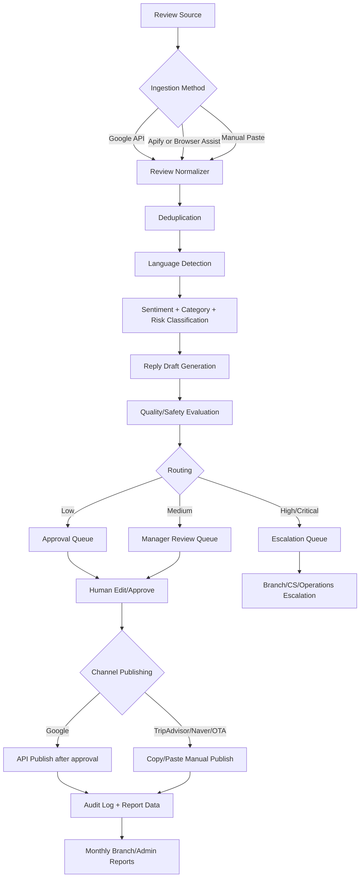

# 03. E2E System Map

## 1. End-to-End Flow

## 2. 시스템 축

| Axis | Description | Owner |
|---|---|---|
| Collection | 리뷰를 가져오는 단계 | Automation/IT |
| Normalization | 채널별 리뷰를 공통 구조로 변환 | Backend |
| Intelligence | 언어/감성/위험/답변 초안 생성 | AI Layer |
| Approval | 사람이 확인·수정·승인 | Ops/CS |
| Publishing | Google API 게시 또는 수동 복붙 | Ops/Automation |
| Reporting | 지점/본부 월간 보고 | HQ/Ops |
| Governance | 정책/감사/보안/품질 | System Manager |

## 3. 데이터가 반드시 남아야 하는 이유

리뷰 자동화는 단순 편의 기능이 아니라, 향후 지점 운영 품질과 브랜드 평판을 관리하는 데이터 인프라입니다.  
따라서 “답변을 빨리 다는 것”보다 “왜 이 답변이 생성됐고 누가 승인했는지”가 더 중요합니다.

## 4. 핵심 객체

- Branch
- Channel
- Review
- ReviewSourceSnapshot
- AIAnalysis
- ReplyDraft
- ApprovalDecision
- PublishingJob
- AuditLog
- MonthlyReport
- PromptVersion
- RiskRule
