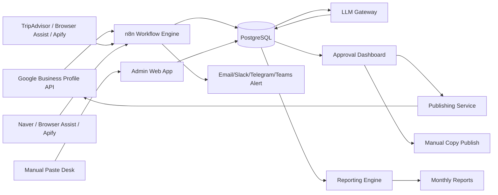

# Architecture 01. System Overview

## 1. Architecture

## 2. Components

| Component | Responsibility |
|---|---|
| n8n | scheduled collection, API calls, alerts |
| PostgreSQL | normalized review data and logs |
| Admin Web App | approval dashboard and manual input |
| LLM Gateway | prompt versioning, model routing, safety evaluation |
| Publishing Service | Google reply API and manual publish tracking |
| Reporting Engine | monthly report generation |
| Monitoring | workflow failure, API failure, spend alerts |

## 3. Design Principle

n8n handles workflows.  
The app/database handles state.  
LLM handles draft and analysis.  
Human handles approval and risk judgment.
