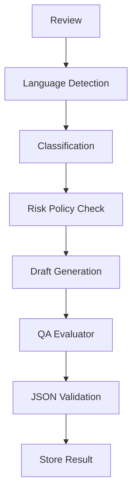

# Architecture 05. LLM Gateway

## 1. Purpose

The LLM Gateway prevents prompts from being scattered across n8n nodes and code. It centralizes:
- prompt versioning
- model routing
- JSON validation
- safety evaluation
- retry policy
- cost tracking

## 2. Pipeline

## 3. Model Routing

| Task | Model |
|---|---|
| Language detection | low-cost or deterministic |
| Classification | mid-cost |
| Draft generation | high-quality |
| High-risk careful draft | high-quality |
| QA evaluator | mid-cost |
| Monthly report | high-quality |

## 4. Output Rules

All AI outputs must return valid JSON. Markdown prose is not allowed in internal pipeline outputs.

## 5. Retry

- Retry invalid JSON once with repair prompt.
- If still invalid, mark AI_FAILED.
- Do not silently publish.
