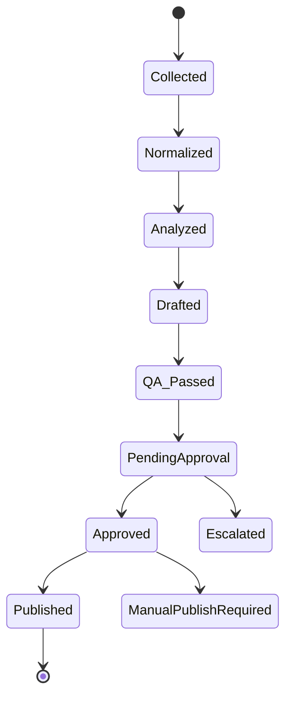

# Architecture 07. Agent and MCP Design

## 1. Agent Roles

| Agent | Role |
|---|---|
| Collector Agent | gathers new reviews through approved paths |
| Normalizer Agent | transforms source payloads into canonical schema |
| Reply Agent | generates drafts |
| QA Agent | evaluates draft safety and localization |
| Report Agent | generates monthly analysis |
| Ops Assistant Agent | helps manager edit replies |
| Research Agent | checks updated API/vendor policy before channel expansion |

## 2. MCP/Tool Boundary

Allowed:
- read approved API
- read internal DB
- call LLM gateway
- create draft
- update status
- send notifications

Forbidden:
- bypass CAPTCHA/login
- publish without approval
- alter policy files without review
- create fake review content
- delete audit logs

## 3. Agent State Machine

## 4. Agent Harness

Each agent action must record:
- actor
- tool used
- input ID
- output ID
- timestamp
- error
- policy version
