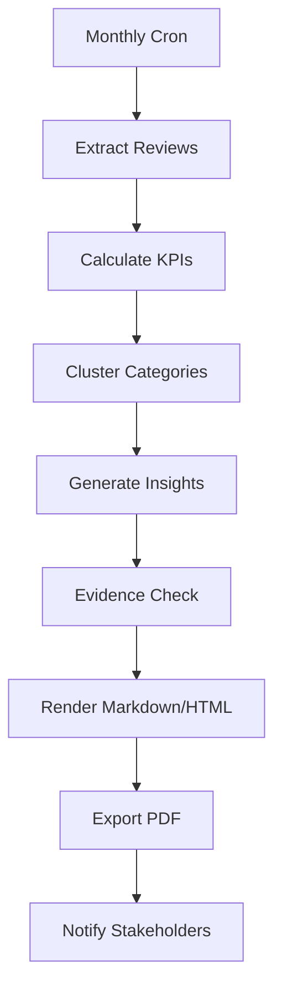

# Architecture 09. Reporting Engine

## 1. Inputs

- reviews
- ai_analyses
- reply_drafts
- approval_decisions
- publishing_jobs
- audit_logs
- branch/channel metadata

## 2. Outputs

- branch monthly report
- HQ monthly report
- high-risk digest
- unresolved review list
- language quality report
- automation performance report

## 3. Report Generation Flow

## 4. Evidence Gate

AI cannot recommend operational changes unless evidence level is at least moderate.

## 5. Report Language

- Domestic branch reports: Korean
- Global branch reports: English
- HQ admin report: Korean by default, English optional
